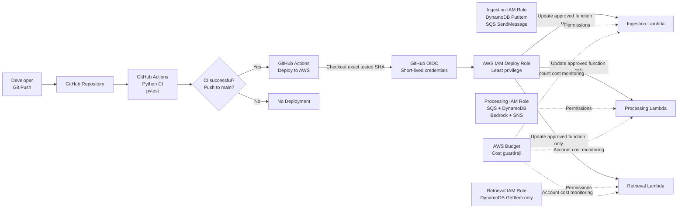

# AWS AI Lead Qualification Bot

Serverless asynchronous lead qualification system built with AWS CLI.

## Business Problem

Businesses receiving leads through websites, campaigns or internal systems often need to decide quickly which enquiries deserve immediate attention.

Performing AI qualification synchronously inside the public request creates several problems:

- AI inference can add latency to the customer-facing request.
- temporary AI failures can cause the entire submission to fail.
- sudden traffic spikes can increase downstream processing and cost.
- duplicate processing can create inconsistent lead outcomes.
- failed leads can disappear without an operational recovery path.

This project demonstrates a low-cost AWS architecture that accepts a lead quickly, stores it safely, processes qualification asynchronously with Amazon Bedrock, prevents duplicate processing, validates AI output and isolates repeated failures for operational review.

## Architecture

The system is split into two views:

1. **Application architecture** ? how leads move through the system.
2. **Delivery and security architecture** ? how tested code is deployed safely to AWS.

### Application Architecture

```mermaid
flowchart TD
    Client["Client / Webhook"]

    API["API Gateway HTTP API<br/>POST /leads<br/>GET /leads/{lead_id}<br/>POST throttle: 1 req/s, burst 2"]

    Ingest["Ingestion Lambda<br/>Validate request<br/>Use caller lead_id<br/>Duplicate-safe write"]

    Retrieve["Retrieval Lambda<br/>Read-only GetItem<br/>Return non-PII result"]

    DB[("DynamoDB<br/>Lead state")]

    Queue["SQS Processing Queue<br/>Visibility timeout: 180s"]

    Mapping["SQS Event Source Mapping<br/>Batch size: 1<br/>Max concurrency: 2"]

    Process["Processing Lambda<br/>30s timeout"]

    Bedrock["Amazon Bedrock<br/>Nova Micro"]

    HotSNS["SNS<br/>HOT Lead Alerts"]

    HotEmail["HOT Lead Email"]

    DLQ["SQS Dead-Letter Queue<br/>After 3 failed receives"]

    Alarm["CloudWatch Alarm<br/>DLQ messages >= 1"]

    OpsSNS["SNS<br/>Operational Alerts"]

    OpsEmail["Operational Alert Email"]

    Logs["CloudWatch Logs<br/>Structured, PII-conscious"]

    Client -->|POST /leads| API
    Client -->|GET /leads/{lead_id}| API

    API -->|POST /leads| Ingest
    API -->|GET /leads/{lead_id}| Retrieve

    Ingest -->|Persist PENDING lead| DB
    Ingest -->|Enqueue lead_id only| Queue

    Retrieve -->|Read lead result| DB

    Queue --> Mapping
    Mapping --> Process

    Process -->|Atomic conditional claim<br/>120s processing lease| DB
    Process -->|Company + message only| Bedrock
    Bedrock -->|Validated structured JSON| Process

    Process -->|HOT / WARM / COLD<br/>category + summary + reason + confidence| DB
    Process -->|HOT only| HotSNS
    HotSNS --> HotEmail

    Queue -->|Repeated failure| DLQ
    DLQ --> Alarm
    Alarm --> OpsSNS
    OpsSNS --> OpsEmail

    Ingest -. Structured logs .-> Logs
    Process -. Structured logs .-> Logs
    Retrieve -. Structured logs .-> Logs
```

### Request Flow

1. API Gateway receives `POST /leads` containing caller-supplied `lead_id`, `name`, `email`, and `message`; `company` is optional.
2. The ingestion Lambda validates required fields, field types, email format, and input length limits.
3. DynamoDB conditionally stores the lead as `PENDING` using the caller-supplied `lead_id`, preventing an existing lead from being overwritten.
4. Only the `lead_id` is placed on SQS, minimising sensitive data in transit.
5. The API returns `202 Accepted` without waiting for AI inference.
6. The SQS event source invokes the processing Lambda with batch size 1 and controlled concurrency.
7. The processing Lambda atomically claims the lead as `PROCESSING` using a temporary lease, preventing duplicate AI processing.
8. Only the information required for qualification is sent to Amazon Bedrock; the lead email is not sent to the model.
9. Bedrock returns `category`, `summary`, `reason`, and `confidence`, which are validated before persistence.
10. DynamoDB is updated with a final classification of `HOT`, `WARM`, or `COLD`.
11. Only `HOT` leads generate an SNS sales notification.
12. `GET /leads/{lead_id}` invokes a read-only retrieval Lambda and returns the qualification result without exposing the stored email or full message.
13. Repeated processing failures move to the DLQ and trigger an operational alert through CloudWatch and SNS.

### Delivery and Security Architecture



### Deployment Controls

- CI runs automated tests before deployment.
- Failed CI does not deploy to AWS.
- CD deploys the exact commit SHA that CI tested.
- GitHub authenticates to AWS through OIDC rather than stored access keys.
- The deployment role is scoped only to the two project Lambda functions.
- Runtime Lambda roles use separate least-privilege permissions.
- Documentation-only changes do not trigger unnecessary Lambda deployments.
- An AWS Budget alert provides an additional cost guardrail.

## Project Goals

- AWS CLI only
- £0 out-of-pocket using AWS Free Tier / free-plan credits
- Least-privilege IAM
- Asynchronous and resilient architecture
- Production-style logging and failure handling
- Document architecture decisions, trade-offs and alternatives

## Bedrock Access Verification

During end-to-end testing, the processing Lambda successfully reached the Amazon Bedrock Converse API using the configured least-privilege IAM role.

The first live Nova Micro invocation returned:

`AccessDeniedException: Your account is currently being verified.`

### Assessment

This was identified as an AWS account-level Bedrock verification restriction rather than an application-code or IAM-policy failure.

The processing Lambda already has:

- `bedrock:InvokeModel`
- access restricted to `amazon.nova-micro-v1:0`

No additional IAM permissions were added because doing so would not resolve an account-verification restriction and would unnecessarily weaken the least-privilege security model.

### Decision

Keep the existing Bedrock IAM policy unchanged and continue building/testing the surrounding workflow while AWS completes account verification.

### Engineering Principle

Infrastructure or provider-level restrictions should be distinguished from application defects before changing code or security permissions.


## Architecture Decision Matrix

| Area | Decision | Why | Trade-off / Alternative |
|---|---|---|---|
| Bedrock verification failure | Do not broaden IAM permissions | The live Converse call reached Bedrock but was blocked by AWS account verification, not by missing role permissions | Wait for account verification instead of weakening least-privilege IAM |

### SQS Visibility Timeout

The processing Lambda has a 30-second execution timeout. The SQS processing queue is configured with a 180-second visibility timeout.

This follows AWS guidance to set the queue visibility timeout to at least six times the Lambda timeout when SQS is used as a Lambda event source.

**Why this matters:**
- Prevents a message becoming visible again while the Lambda may still be processing it.
- Reduces accidental duplicate processing.
- Gives AWS room for throttling and retry behaviour.
- Works alongside the application-level idempotency guard.

**Trade-off:**  
A longer visibility timeout means a genuinely failed message takes longer to become available for another processing attempt. For this asynchronous lead-qualification workload, reliability is more important than retrying within a few seconds.

**Alternative:**  
For latency-sensitive workloads, a shorter Lambda timeout and correspondingly shorter SQS visibility timeout could reduce retry delay.

## End-to-End Async Validation

The complete asynchronous lead qualification workflow was tested successfully against the deployed AWS environment.

Live acceptance testing proved all three required classifications:

- `HOT` lead -> classified and persisted as `HOT`
- `WARM` lead -> classified and persisted as `WARM`
- `COLD` lead -> classified and persisted as `COLD`
- Structured model output included `category`, `summary`, `reason`, and `confidence`
- Only the `HOT` lead generated the sales SNS email notification
- `WARM` and `COLD` processing completed without a sales notification

Example live HOT result:

```json
{
  "lead_id": "portfolio-hot-test-001",
  "status": "HOT",
  "category": "HOT",
  "summary": "A company with 12 locations seeking AI lead qualification and automation system integration with a ready budget and immediate implementation intent.",
  "reason": "The lead clearly states an immediate business need, strong buying intent, and sufficient detail for prompt sales follow-up.",
  "confidence": 90
}
```

The HOT notification email was received successfully through SNS.

Live WARM and COLD tests returned confidence values of 70 and produced no HOT sales notification.

Duplicate handling was also tested using the same caller-supplied `lead_id`. The API returned:

```json
{
  "status": "EXISTING",
  "duplicate": true
}
```

CloudWatch logs then showed `duplicate_skipped` with the existing final status and no second qualification event, proving the duplicate was stopped before another Bedrock invocation.

This validates the complete asynchronous architecture rather than testing each component only in isolation.

## Public API Gateway

A public Amazon API Gateway HTTP API exposes two application routes:

- `POST /leads`
- `GET /leads/{lead_id}`

`POST /leads` invokes the ingestion Lambda using AWS_PROXY integration and accepts:

- `lead_id`
- `name`
- `email`
- `message`
- optional `company`

`GET /leads/{lead_id}` invokes a separate read-only retrieval Lambda.

The retrieval response exposes qualification data but intentionally excludes the stored email address and original message.

### API Security and Cost Guardrail

The `POST /leads` route is configured with:

- Steady-state throttling: 1 request per second
- Burst limit: 2 requests

This reduces the risk of accidental or abusive traffic generating unnecessary Lambda, SQS and Bedrock usage.

Throttling is a cost and availability guardrail, not an authentication mechanism. A production deployment could additionally introduce authentication, bot protection or edge security depending on whether the lead endpoint is intended to be public or restricted.

### Public API Validation

The deployed public endpoint was tested with both invalid and valid requests.

Invalid request:

- Missing required `lead_id`
- Returned HTTP 400
- Rejected before SQS and Bedrock processing

Valid request:

- Returned HTTP 202 Accepted
- Persisted the caller-supplied lead ID to DynamoDB
- Enqueued only the lead ID through SQS
- Automatically invoked the processing Lambda
- Amazon Nova Micro returned structured qualification output
- DynamoDB was updated to `HOT`, `WARM`, or `COLD`
- Only the HOT test generated the sales SNS email

Retrieval validation:

- Existing leads were retrieved through `GET /leads/{lead_id}`
- A nonexistent lead returned HTTP 404
- Retrieval responses excluded stored PII such as email and the original lead message


### Processing Concurrency Guardrail

The SQS event source mapping for the processing Lambda is configured with:

- Batch size: 1
- Maximum concurrency: 2

This means SQS can buffer a large backlog of leads, but only two processing Lambda executions can run at the same time.

This protects the Bedrock integration from uncontrolled fan-out and helps contain AI inference usage and cost.

An initial attempt was made to use Lambda reserved concurrency. AWS rejected this because the account must retain a minimum level of unreserved concurrency. Rather than reserving account-wide capacity, the concurrency limit was moved to the SQS event source mapping.

**Why this is preferable here:**
- Limits concurrency specifically at the queue-to-processing boundary
- Preserves account-wide Lambda capacity
- Allows SQS to absorb traffic spikes safely
- Reduces the risk of excessive simultaneous Bedrock calls

**Trade-off:**  
A large backlog will process more slowly because only two messages can be processed concurrently. For this lead-qualification workload, predictable cost and controlled scaling are more important than maximum throughput.


### Atomic Idempotency and Processing Lease

SQS Standard provides at-least-once delivery, so the same lead message can occasionally be delivered more than once.

A simple status check is not sufficient on its own because two Lambda invocations could both read a lead while its status is still `PENDING` and both call Bedrock.

The processing Lambda therefore uses a conditional DynamoDB update to atomically claim the lead:

- `PENDING` becomes `PROCESSING`
- A 120-second processing lease is written at the same time
- Only the invocation that successfully acquires the claim continues to Bedrock
- Duplicate invocations fail the conditional update and stop before inference
- If processing crashes, the lease eventually expires so a later SQS retry can reclaim the lead
- On successful completion, the lead becomes `HOT`, `WARM`, or `COLD` and the temporary lease is removed

The timing relationship is:

- Processing Lambda timeout: 30 seconds
- Processing lease: 120 seconds
- SQS visibility timeout: 180 seconds

This provides duplicate protection without permanently locking a lead if processing fails.

Live testing confirmed that a new lead moved through `PENDING` -> `PROCESSING` -> a final `HOT`, `WARM`, or `COLD` classification. Duplicate delivery of an already completed lead produced `duplicate_skipped` and stopped before another Bedrock invocation.


### Dead-Letter Queue Validation

The processing queue is configured with a dead-letter queue and a maximum receive count of 3.

A live poison-message test was performed by sending a malformed processing message into the real SQS queue.

Observed behaviour:

- SQS delivered the message to the processing Lambda
- The Lambda rejected the malformed payload during JSON parsing
- The message was retried automatically
- Retry attempts followed the configured 180-second visibility timeout
- After the maximum receive count was reached, SQS moved the message to the dead-letter queue
- The failed message was successfully retrieved from the DLQ for inspection
- Failure occurred before the Bedrock invocation, avoiding unnecessary model inference usage

This demonstrates that malformed or repeatedly failing messages do not disappear silently and can be isolated for investigation or later redrive.


### DLQ Monitoring and Operational Alerts

The dead-letter queue is monitored with a CloudWatch alarm on the SQS `ApproximateNumberOfMessagesVisible` metric.

Alarm configuration:

- Metric: `ApproximateNumberOfMessagesVisible`
- Queue: `ai-lead-qualification-dlq`
- Evaluation period: 60 seconds
- Threshold: 1 or more visible messages
- Missing data treatment: `notBreaching`
- Alarm action: dedicated SNS operations topic
- Notification destination: confirmed operations email subscription

A live failure test confirmed the complete monitoring path:

- Failed processing messages were moved to the DLQ
- CloudWatch detected 2 visible DLQ messages
- Alarm changed from `INSUFFICIENT_DATA` to `ALARM`
- SNS published the operational alert
- Alert email was received successfully

This separates business notifications from infrastructure alerts and ensures failed workloads do not remain unnoticed.


The alarm recovery path was also validated:

- Test messages were removed from the DLQ
- CloudWatch published fresh `0` datapoints
- The alarm transitioned automatically from `ALARM` back to `OK`

This confirms the monitoring state reflects the actual health of the queue rather than remaining latched after an incident.


### Structured Application Logging

The processing Lambda emits structured JSON logs to CloudWatch for key lifecycle events:

- `lead_received`
- `lead_claimed`
- `qualification_complete`
- `notification_sent`
- `duplicate_skipped`
- `claim_skipped`

Logs intentionally include only operational fields such as:

- `lead_id`
- `status`
- `confidence`

Personally identifiable lead data such as names, email addresses and full lead messages are not written to application logs.

Live acceptance tests demonstrated:

- A `HOT` lead progressed through `lead_received`, `lead_claimed`, `qualification_complete`, and the notification path
- `WARM` and `COLD` leads completed qualification without a HOT sales notification
- A duplicate completed lead produced `duplicate_skipped` and returned before another Bedrock invocation

This provides operational traceability while reducing unnecessary exposure of customer data in CloudWatch.


### Ingestion Lambda Structured Logging

The ingestion Lambda also emits privacy-conscious structured JSON logs.

Successful request lifecycle:

- `request_received`
- `validation_passed`
- `lead_persisted`
- `lead_enqueued`

Rejected requests emit:

- `request_received`
- `validation_failed`

Operational fields such as `request_id`, `lead_id` and status are logged, while customer data including names, email addresses, company names and full lead messages are excluded.

A live successful API request confirmed the full ingestion log sequence and completed in approximately 481 ms using 96 MB of the Lambda's 128 MB memory allocation.

This provides traceability across the API ingestion path without unnecessarily exposing lead data in CloudWatch.


### Public Input Validation Hardening

The public `POST /leads` endpoint validates both field presence and field quality before data is persisted or sent for AI processing.

Current validation rules:

- `lead_id`: required string, maximum 100 characters
- `name`: required string, maximum 100 characters
- `email`: required string, maximum 254 characters, basic email-format validation
- `message`: required string, maximum 2,000 characters
- `company`: optional string, maximum 200 characters
- Empty required values are rejected
- Incorrect data types are rejected

DynamoDB uses a conditional write on `lead_id` so an existing lead cannot be overwritten accidentally.

Live validation tests confirmed:

- Missing `lead_id` returns HTTP 400
- Non-string field values are rejected
- Invalid email formats are rejected
- Messages longer than 2,000 characters are rejected
- Rejected requests do not proceed to AI processing
- Valid requests complete the asynchronous workflow successfully
- Only leads ultimately classified as `HOT` trigger the sales notification

The message-length limit also acts as an AI cost guardrail by preventing excessively large user-controlled prompts from reaching Bedrock.


## Automated Tests

The project includes local unit tests using `pytest`.

Current coverage includes:

### Ingestion validation

- Valid lead with caller-supplied `lead_id`
- Optional `company`
- Invalid email format
- Incorrect field data types
- Oversized lead messages
- Invalid `lead_id` type

### Processing validation

- Valid `HOT` model output
- Valid `WARM` model output
- Valid `COLD` model output
- Invalid classification category
- Confidence outside the 0-100 range
- Missing or empty `summary`
- Missing or empty `reason`

### Retrieval validation

- Missing path `lead_id` returns HTTP 400
- Unknown lead returns HTTP 404
- Successful retrieval returns qualification data without exposing stored email or original message

Current test result:

- 16 tests passed
- 0 tests failed

GitHub Actions runs the test suite using Python 3.13 before deployment. The CD workflow only deploys after successful CI and checks out the exact tested commit SHA.


## CI/CD Pipeline

The project uses GitHub Actions for continuous integration and AWS deployment.

### Continuous Integration

The CI workflow runs automatically on pushes and pull requests to `main`.

It:

- Checks out the repository
- Configures Python 3.13
- Installs development dependencies
- Runs the complete pytest suite
- Fails the workflow if automated tests fail

The first live CI run completed successfully with all 9 tests passing.

### Continuous Deployment

A separate deployment workflow automatically deploys the exact commit that successfully passed Python CI on `main`.

The deployment workflow:

- Triggers only after a successful Python CI run caused by a push to `main`
- Retains `workflow_dispatch` for manual deployment when required
- Checks out the exact CI-tested commit using `workflow_run.head_sha`
- Runs the automated test suite again before deployment
- Authenticates to AWS using GitHub OIDC
- Uses temporary AWS credentials rather than stored access keys
- Packages both Lambda functions
- Deploys the ingestion Lambda
- Waits for the deployment to complete
- Deploys the processing Lambda
- Waits for the deployment to complete

Documentation-only changes are excluded from CI using path filters, preventing unnecessary Lambda redeployments.

AWS trust is restricted to the exact GitHub repository and `main` branch using immutable GitHub owner and repository identifiers.

The deployment role follows least privilege and can only update and inspect:

- `ai-lead-ingestion`
- `ai-lead-processing`

It cannot modify IAM, DynamoDB, SQS, API Gateway, Bedrock or unrelated Lambda functions.

### Least-Privilege Deployment Validation

The first CD run exposed a missing `lambda:GetFunction` permission during the Lambda deployment waiter step.

The Lambda code update itself succeeded, but GitHub Actions could not verify completion.

Rather than assigning broad Lambda permissions, only the required `lambda:GetFunction` read permission was added to the deployment role.

The workflow was rerun successfully and completed the full CI/CD deployment path.

