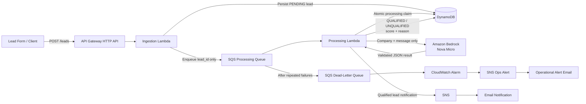

# AWS AI Lead Qualification Bot

Serverless asynchronous lead qualification system built with AWS CLI.

## Architecture



### Request Flow

A public lead submission is validated by the ingestion Lambda, persisted in DynamoDB and acknowledged quickly with HTTP `202 Accepted`.

Only the generated `lead_id` is placed on SQS. The processing Lambda retrieves the lead, claims it atomically to prevent duplicate processing, sends minimised lead content to Amazon Bedrock, validates the model response and updates the persistent lead status.

Repeated processing failures are isolated in the DLQ and trigger a CloudWatch operational alert.

## Project Goals

- AWS CLI only
- £0 out-of-pocket using AWS Free Tier / free-plan credits
- Least-privilege IAM
- Asynchronous and resilient architecture
- Production-style logging and failure handling
- Document architecture decisions, trade-offs and alternatives

## Bedrock Access Verification

During end-to-end testing, the processing Lambda successfully reached the Amazon Bedrock Converse API using the configured least-privilege IAM role.

The first live Nova Micro invocation returned:

`AccessDeniedException: Your account is currently being verified.`

### Assessment

This was identified as an AWS account-level Bedrock verification restriction rather than an application-code or IAM-policy failure.

The processing Lambda already has:

- `bedrock:InvokeModel`
- access restricted to `amazon.nova-micro-v1:0`

No additional IAM permissions were added because doing so would not resolve an account-verification restriction and would unnecessarily weaken the least-privilege security model.

### Decision

Keep the existing Bedrock IAM policy unchanged and continue building/testing the surrounding workflow while AWS completes account verification.

### Engineering Principle

Infrastructure or provider-level restrictions should be distinguished from application defects before changing code or security permissions.


## Architecture Decision Matrix

| Area | Decision | Why | Trade-off / Alternative |
|---|---|---|---|
| Bedrock verification failure | Do not broaden IAM permissions | The live Converse call reached Bedrock but was blocked by AWS account verification, not by missing role permissions | Wait for account verification instead of weakening least-privilege IAM |

### SQS Visibility Timeout

The processing Lambda has a 30-second execution timeout. The SQS processing queue is configured with a 180-second visibility timeout.

This follows AWS guidance to set the queue visibility timeout to at least six times the Lambda timeout when SQS is used as a Lambda event source.

**Why this matters:**
- Prevents a message becoming visible again while the Lambda may still be processing it.
- Reduces accidental duplicate processing.
- Gives AWS room for throttling and retry behaviour.
- Works alongside the application-level idempotency guard.

**Trade-off:**  
A longer visibility timeout means a genuinely failed message takes longer to become available for another processing attempt. For this asynchronous lead-qualification workload, reliability is more important than retrying within a few seconds.

**Alternative:**  
For latency-sensitive workloads, a shorter Lambda timeout and correspondingly shorter SQS visibility timeout could reduce retry delay.

## End-to-End Async Validation

The complete asynchronous lead qualification workflow was tested successfully in AWS.

Test result:

- Lead submitted to the ingestion Lambda
- API-style response returned `202 Accepted`
- Lead persisted to DynamoDB with `PENDING` status
- SQS automatically triggered the processing Lambda
- Processing Lambda retrieved the lead from DynamoDB
- Amazon Nova Micro evaluated the business requirement
- Model output passed application-level validation
- Lead was scored `85`
- Final status updated to `QUALIFIED`
- Qualification reason persisted to DynamoDB
- SNS published the qualified-lead notification
- Notification email was received successfully

Example qualification result:

```json
{
  "status": "QUALIFIED",
  "qualification_score": 85,
  "qualification_reason": "Clear business need for AI chatbot to manage candidate inquiries and integrate with CRM."
}
```

This validates the complete asynchronous architecture rather than testing each component only in isolation.


## Public API Gateway

A public Amazon API Gateway HTTP API exposes the ingestion workflow through:

POST /leads

The HTTP API uses an AWS_PROXY integration with the ingestion Lambda and payload format version 2.0.

### API Security and Cost Guardrail

The POST /leads route is configured with:

- Steady-state throttling: 1 request per second
- Burst limit: 2 requests

This reduces the risk of accidental or abusive traffic generating unnecessary Lambda, SQS and Bedrock usage.

Throttling is a cost and availability guardrail, not an authentication mechanism. A production deployment could additionally introduce authentication, bot protection or edge security depending on whether the lead endpoint is intended to be public or restricted.

### Public API Validation

The public endpoint was tested with both invalid and valid requests.

Invalid request:
- Missing required fields
- Returned HTTP 400
- Rejected before SQS and Bedrock processing

Valid production-style request:
- Returned HTTP 202 Accepted
- Persisted the lead to DynamoDB
- Enqueued the lead ID through SQS
- Automatically invoked the processing Lambda
- Amazon Nova Micro scored the lead 85
- DynamoDB status was updated to QUALIFIED
- SNS notification email was received successfully


### Processing Concurrency Guardrail

The SQS event source mapping for the processing Lambda is configured with:

- Batch size: 1
- Maximum concurrency: 2

This means SQS can buffer a large backlog of leads, but only two processing Lambda executions can run at the same time.

This protects the Bedrock integration from uncontrolled fan-out and helps contain AI inference usage and cost.

An initial attempt was made to use Lambda reserved concurrency. AWS rejected this because the account must retain a minimum level of unreserved concurrency. Rather than reserving account-wide capacity, the concurrency limit was moved to the SQS event source mapping.

**Why this is preferable here:**
- Limits concurrency specifically at the queue-to-processing boundary
- Preserves account-wide Lambda capacity
- Allows SQS to absorb traffic spikes safely
- Reduces the risk of excessive simultaneous Bedrock calls

**Trade-off:**  
A large backlog will process more slowly because only two messages can be processed concurrently. For this lead-qualification workload, predictable cost and controlled scaling are more important than maximum throughput.


### Atomic Idempotency and Processing Lease

SQS Standard provides at-least-once delivery, so the same lead message can occasionally be delivered more than once.

A simple status check is not sufficient on its own because two Lambda invocations could both read a lead while its status is still `PENDING` and both call Bedrock.

The processing Lambda therefore uses a conditional DynamoDB update to atomically claim the lead:

- `PENDING` becomes `PROCESSING`
- A 120-second processing lease is written at the same time
- Only the invocation that successfully acquires the claim continues to Bedrock
- Duplicate invocations fail the conditional update and stop before inference
- If processing crashes, the lease eventually expires so a later SQS retry can reclaim the lead
- On successful completion, the lead becomes `QUALIFIED` or `UNQUALIFIED` and the temporary lease is removed

The timing relationship is:

- Processing Lambda timeout: 30 seconds
- Processing lease: 120 seconds
- SQS visibility timeout: 180 seconds

This provides duplicate protection without permanently locking a lead if processing fails.

A live test confirmed that a lead moved through `PENDING` -> `PROCESSING` -> `QUALIFIED`, scored 85, had its lease removed, and still generated the expected SNS email notification.


### Dead-Letter Queue Validation

The processing queue is configured with a dead-letter queue and a maximum receive count of 3.

A live poison-message test was performed by sending a malformed processing message into the real SQS queue.

Observed behaviour:

- SQS delivered the message to the processing Lambda
- The Lambda rejected the malformed payload during JSON parsing
- The message was retried automatically
- Retry attempts followed the configured 180-second visibility timeout
- After the maximum receive count was reached, SQS moved the message to the dead-letter queue
- The failed message was successfully retrieved from the DLQ for inspection
- Failure occurred before the Bedrock invocation, avoiding unnecessary model inference usage

This demonstrates that malformed or repeatedly failing messages do not disappear silently and can be isolated for investigation or later redrive.


### DLQ Monitoring and Operational Alerts

The dead-letter queue is monitored with a CloudWatch alarm on the SQS `ApproximateNumberOfMessagesVisible` metric.

Alarm configuration:

- Metric: `ApproximateNumberOfMessagesVisible`
- Queue: `ai-lead-qualification-dlq`
- Evaluation period: 60 seconds
- Threshold: 1 or more visible messages
- Missing data treatment: `notBreaching`
- Alarm action: dedicated SNS operations topic
- Notification destination: confirmed operations email subscription

A live failure test confirmed the complete monitoring path:

- Failed processing messages were moved to the DLQ
- CloudWatch detected 2 visible DLQ messages
- Alarm changed from `INSUFFICIENT_DATA` to `ALARM`
- SNS published the operational alert
- Alert email was received successfully

This separates business notifications from infrastructure alerts and ensures failed workloads do not remain unnoticed.


The alarm recovery path was also validated:

- Test messages were removed from the DLQ
- CloudWatch published fresh `0` datapoints
- The alarm transitioned automatically from `ALARM` back to `OK`

This confirms the monitoring state reflects the actual health of the queue rather than remaining latched after an incident.


### Structured Application Logging

The processing Lambda emits structured JSON logs to CloudWatch for key lifecycle events:

- `lead_received`
- `lead_claimed`
- `qualification_complete`
- `notification_sent`
- `duplicate_skipped`
- `claim_skipped`

Logs intentionally include only operational fields such as:

- `lead_id`
- `status`
- `score`

Personally identifiable lead data such as names, email addresses and full lead messages are not written to application logs.

A live test confirmed the following sequence for a successfully qualified lead:

- `lead_received`
- `lead_claimed`
- `qualification_complete`
- `notification_sent`

The test completed in approximately 3.9 seconds and used 98 MB of the Lambda's 128 MB memory allocation.

This provides operational traceability while reducing unnecessary exposure of customer data in CloudWatch.


### Ingestion Lambda Structured Logging

The ingestion Lambda also emits privacy-conscious structured JSON logs.

Successful request lifecycle:

- `request_received`
- `validation_passed`
- `lead_persisted`
- `lead_enqueued`

Rejected requests emit:

- `request_received`
- `validation_failed`

Operational fields such as `request_id`, `lead_id` and status are logged, while customer data including names, email addresses, company names and full lead messages are excluded.

A live successful API request confirmed the full ingestion log sequence and completed in approximately 481 ms using 96 MB of the Lambda's 128 MB memory allocation.

This provides traceability across the API ingestion path without unnecessarily exposing lead data in CloudWatch.


### Public Input Validation Hardening

The public `POST /leads` endpoint validates both field presence and field quality before data is persisted or sent for AI processing.

Current validation rules:

- `name`: string, maximum 100 characters
- `email`: string, maximum 254 characters, basic email-format validation
- `company`: string, maximum 200 characters
- `message`: string, maximum 2,000 characters
- Empty strings are rejected
- Incorrect data types are rejected

This reduces malformed input, oversized payloads and unnecessary downstream processing.

Live validation tests confirmed:

- Non-string `name` values are rejected
- Invalid email formats are rejected
- Messages longer than 2,000 characters are rejected
- Invalid requests return HTTP 400
- Rejected requests do not reach DynamoDB, SQS or Bedrock
- A valid request still completed the full workflow successfully and generated the expected qualified-lead email notification

The message-length limit also acts as an AI cost guardrail by preventing excessively large user-controlled prompts from reaching Bedrock.


## Automated Tests

The project includes local unit tests using `pytest`.

Current coverage includes:

### Ingestion validation
- Valid lead payloads
- Invalid email formats
- Incorrect field data types
- Oversized lead messages

### Processing validation
- Valid qualified model output
- Valid unqualified model output
- Scores outside the 0-100 range
- `QUALIFIED` decisions below the 70-point threshold
- `UNQUALIFIED` decisions at or above the 70-point threshold
- Notification decision logic

Current test result:

- 9 tests passed
- 0 tests failed

The ingestion Lambda was also refactored so AWS SDK clients are created inside `lambda_handler()` rather than during module import. This keeps pure validation logic independent of AWS configuration and makes local unit testing easier.

Development dependencies are recorded in `requirements-dev.txt` so the test environment can be reproduced after cloning the repository.

Run the test suite with:

`python -m pytest tests -v`


## CI/CD Pipeline

The project uses GitHub Actions for continuous integration and AWS deployment.

### Continuous Integration

The CI workflow runs automatically on pushes and pull requests to `main`.

It:

- Checks out the repository
- Configures Python 3.13
- Installs development dependencies
- Runs the complete pytest suite
- Fails the workflow if automated tests fail

The first live CI run completed successfully with all 9 tests passing.

### Continuous Deployment

A separate deployment workflow provides controlled deployment to AWS.

The deployment workflow:

- Is manually triggered during the initial commissioning phase
- Runs the automated test suite before deployment
- Authenticates to AWS using GitHub OIDC
- Uses temporary AWS credentials rather than stored access keys
- Packages both Lambda functions
- Deploys the ingestion Lambda
- Waits for the deployment to complete
- Deploys the processing Lambda
- Waits for the deployment to complete

AWS trust is restricted to the exact GitHub repository and `main` branch using immutable GitHub owner and repository identifiers.

The deployment role follows least privilege and can only update and inspect:

- `ai-lead-ingestion`
- `ai-lead-processing`

It cannot modify IAM, DynamoDB, SQS, API Gateway, Bedrock or unrelated Lambda functions.

### Least-Privilege Deployment Validation

The first CD run exposed a missing `lambda:GetFunction` permission during the Lambda deployment waiter step.

The Lambda code update itself succeeded, but GitHub Actions could not verify completion.

Rather than assigning broad Lambda permissions, only the required `lambda:GetFunction` read permission was added to the deployment role.

The workflow was rerun successfully and completed the full CI/CD deployment path.

